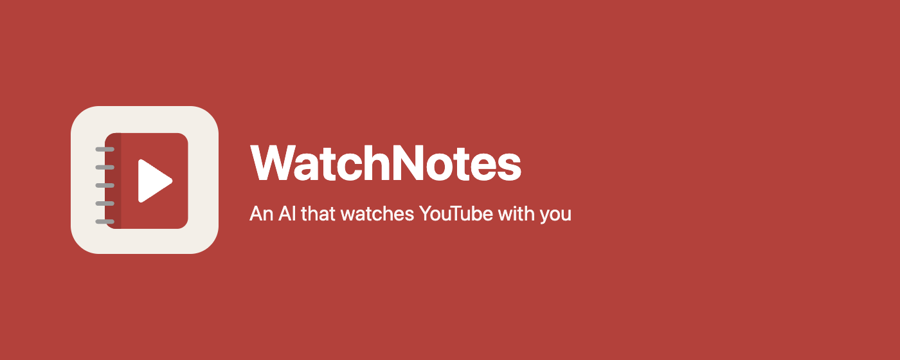
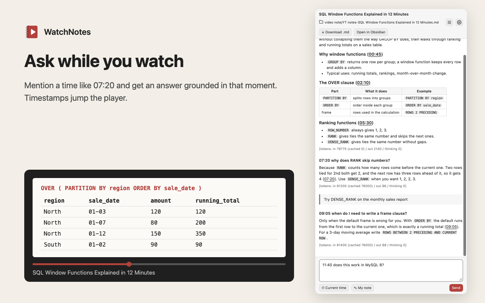
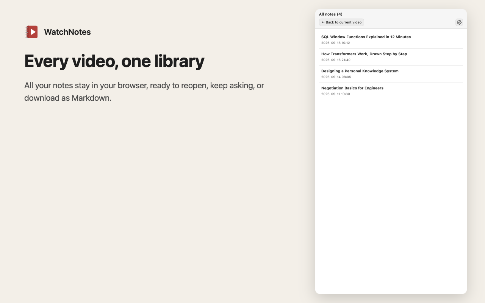
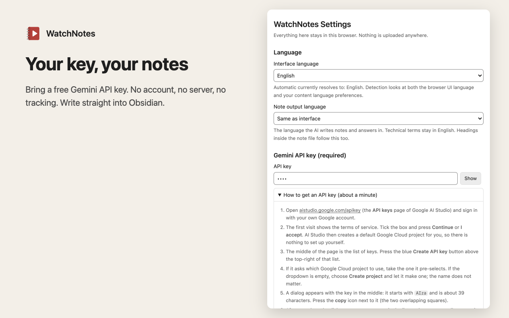
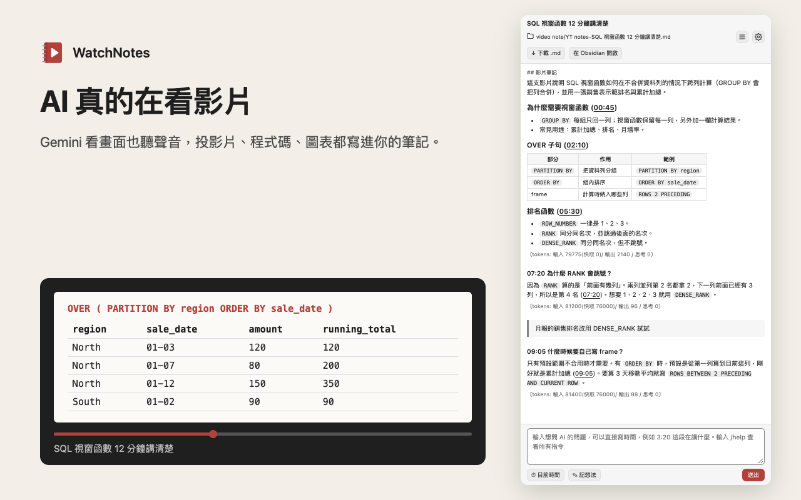
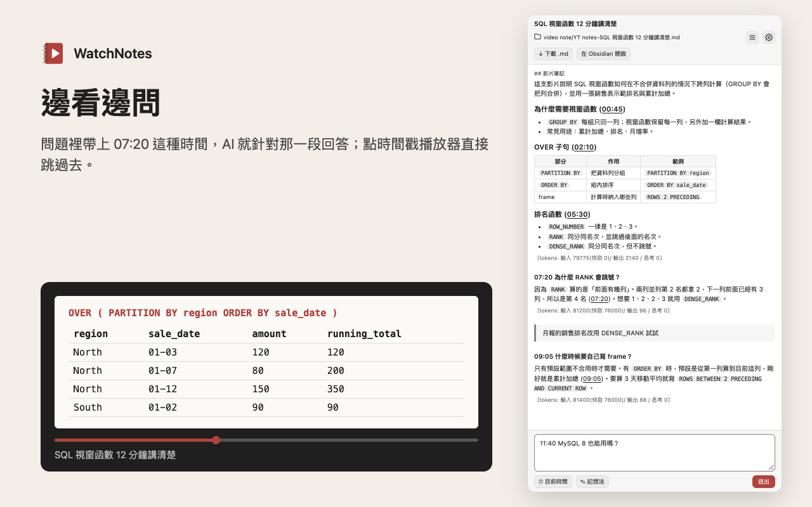
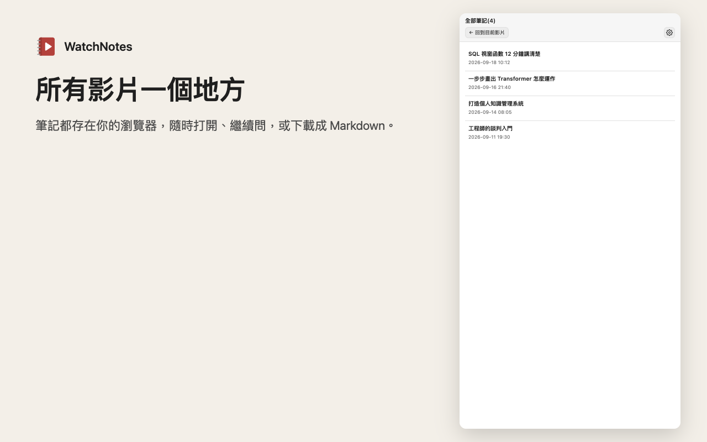

# WatchNotes

**An AI that watches YouTube with you, and writes the notes.** A Chrome / Edge extension that opens a side panel next to the video. Google Gemini watches the video itself, frames and audio together, so slides, code and charts on screen make it into your notes.

[Home page](https://25qi.github.io/watchnotes/) · [Privacy policy](https://25qi.github.io/watchnotes/privacy.html) · [Report an issue](https://github.com/25qi/watchnotes/issues) · [繁體中文說明](#繁體中文)

> Status: coming soon to the Chrome Web Store and Edge Add-ons. Store links will be added here once published.

## Features

| | |
|---|---|
| **It actually watches the video** | Most summary tools only read captions. WatchNotes sends the video to Gemini, so what is on screen is in your notes. |
| **Clickable timestamps** | Every section has timestamps; click one and the player jumps to that second. |
| **Ask while you watch** | Mention a time such as `07:20` and the answer is grounded in that moment. |
| **Two modes** | Watch the video (sees the screen), or read captions (uses much less quota). |
| **One library** | Every video's notes stay in your browser. Reopen, keep asking, or download as Markdown. |
| **Obsidian friendly** | Pick a folder, such as your vault, and notes are written there as `.md` in real time. |
| **Private by design** | Your own free Gemini API key. No account, no server, no tracking. |

## Getting started

1. Install WatchNotes from the Chrome Web Store or Edge Add-ons (links coming soon).
2. Get a free Gemini API key at [aistudio.google.com/apikey](https://aistudio.google.com/apikey) and paste it into the extension's settings. The settings page has a step-by-step guide.
3. Open any YouTube video, click the WatchNotes icon, and press **Start by watching**.

## Privacy

Your key, settings and notes stay in your browser. Requests go straight from your browser to Google's Gemini API with your own key; nothing passes through a developer server. On Google's free tier, Google may use submitted content to improve its products. Details: [privacy policy](https://25qi.github.io/watchnotes/privacy.html).

## About this repository

This public repository hosts the home page, privacy policy and issue tracker. The extension source code is not published here.

WatchNotes is not affiliated with or endorsed by YouTube or Google.

---

## 繁體中文

**陪你看 YouTube 的 AI，順便把筆記寫好。** WatchNotes 是 Chrome / Edge 擴充套件，在影片旁開一個側邊面板，由 Google Gemini 直接看影片（畫面加聲音），投影片、程式碼、圖表的內容都會寫進你的筆記。

[首頁](https://25qi.github.io/watchnotes/?lang=zh) · [隱私權政策](https://25qi.github.io/watchnotes/privacy.html?lang=zh) · [問題回報](https://github.com/25qi/watchnotes/issues)

> 狀態：即將上架 Chrome 線上應用程式商店與 Edge 附加元件，上架後會在這裡放連結。

### 功能

| | |
|---|---|
| **AI 真的在看影片** | 多數摘要工具只讀字幕；WatchNotes 把影片交給 Gemini，畫面上的內容也會寫進筆記。 |
| **可點的時間戳** | 每段都有時間戳，點一下播放器就跳到那一秒。 |
| **邊看邊問** | 問題裡帶上 `07:20` 這種時間，AI 就針對那一段回答。 |
| **兩種模式** | 看影片（讀得到畫面），或讀字幕（省很多額度）。 |
| **全部筆記一個地方** | 每部影片的筆記都存在瀏覽器，隨時打開、繼續問，或下載成 Markdown。 |
| **支援 Obsidian** | 選一個資料夾（例如你的 vault），筆記會即時寫成 `.md`。 |
| **隱私優先** | 使用你自己的免費 Gemini API key；不用帳號、沒有伺服器、不追蹤。 |

### 開始使用

1. 從 Chrome 線上應用程式商店或 Edge 附加元件安裝 WatchNotes（連結即將提供）。
2. 到 [aistudio.google.com/apikey](https://aistudio.google.com/apikey) 免費申請 Gemini API key，貼到擴充套件的設定頁；設定頁有逐步教學。
3. 打開任何一部 YouTube 影片，點工具列的 WatchNotes 圖示，按 **看影片開始**。

### 隱私

你的 key、設定和筆記都只存在你的瀏覽器。請求從你的瀏覽器用你自己的 key 直接送到 Google Gemini API，不經過任何開發者伺服器。使用免費層時，Google 可能用送出的內容改進產品。詳見[隱私權政策](https://25qi.github.io/watchnotes/privacy.html?lang=zh)。

### 關於這個 repo

這個公開 repo 只放首頁、隱私權政策與問題回報，擴充套件的原始碼不在這裡。

WatchNotes 與 YouTube、Google 沒有任何關聯，也未獲其背書。
